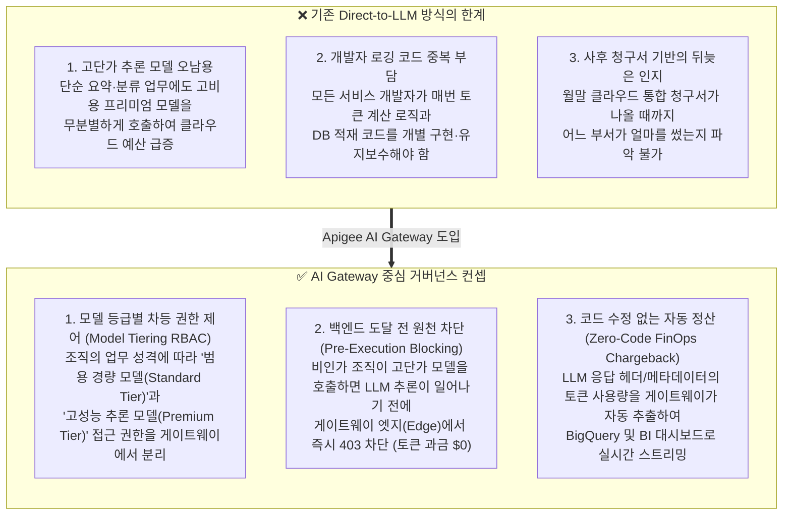
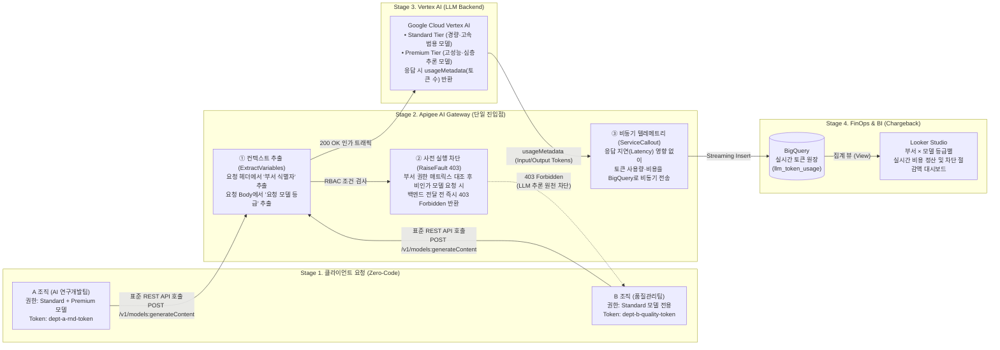

# 🏛️ Enterprise AI Gateway Governance & FinOps Chargeback Architecture

> **단일 AI 게이트웨이(Apigee) 기반의 부서별 LLM 접근 제어(RBAC) 및 실시간 비용 정산(Chargeback/Showback) 참조 아키텍처**  
> 기업 내 다양한 조직이 생성형 AI(LLM)를 도입할 때 발생하는 **무분별한 고단가 모델 호출**, **애플리케이션별 중복 로깅 코드 개발**, **부서별 AI 예산 통제 불가** 문제를 애플리케이션 코드 수정 없이 **API Gateway 계층에서 일괄 해결**하는 엔터프라이즈 AI 거버넌스 블루프린트입니다.

---

## 💡 1. 왜 Enterprise AI Gateway가 필요한가? (Core Concept)

기업이 생성형 AI를 전사적으로 확산할 때, 개별 애플리케이션이 LLM 백엔드를 직접 호출하는 구조(Direct-to-LLM)는 다음과 같은 구조적 한계를 가집니다:



---

## 🏗️ 2. 핵심 아키텍처 설계 (4-Stage Governance Pipeline)

본 아키텍처는 **클라이언트 요청 ➔ API Gateway 정책 검증 ➔ AI 추론 백엔드 ➔ 실시간 FinOps 데이터 웨어하우스**로 이어지는 4단계 파이프라인으로 동작합니다.



---

## 🎯 3. 엔터프라이즈 거버넌스 3대 핵심 메커니즘

### ① 개발자 편의성 보장 (Zero-Code Instrumentation)
* **컨셉**: 현업 애플리케이션 개발자는 사내 거버넌스나 비용 정산을 위해 기존 코드를 수정하거나 별도 SDK를 설치할 필요가 없습니다.
* **작동 방식**: 표준 LLM 호출 규격(Endpoint URL 및 Payload 구조)을 그대로 유지한 채 **접속 주소만 사내 Apigee AI Gateway로 지정**하고 부서 API 토큰만 헤더(`Authorization: Bearer <DEPT_TOKEN>`)에 포함하면 모든 인증·권한 검증·토큰 로깅이 게이트웨이에서 투명하게 처리됩니다.

### ② 모델 등급별 차등 접근 제어 (Model Tiering & Edge-Level RaiseFault)
* **컨셉**: 모든 부서에 동일한 AI 모델을 열어주는 대신, 업무 난이도와 예산에 맞춰 모델 등급을 구분합니다.
  * **Standard Tier (범용·경량 모델)**: 문서 요약, 번역, 단순 분류 등 일상적인 업무용 (낮은 토큰 단가)
  * **Premium Tier (고성능·추론 모델)**: 복잡한 아키텍처 설계, 코드 생성, 다단계 추론 업무용 (Standard 대비 약 8~15배 높은 토큰 단가)
* **작동 방식**: Apigee의 `ExtractVariables` 정책이 HTTP 헤더의 부서 식별자와 JSON Body의 모델 필드를 실시간 파싱합니다. 허용되지 않은 부서가 Premium Tier 모델을 호출할 경우, `RaiseFault` 정책이 즉시 동작하여 **백엔드 LLM에 요청이 도달하기 전에 HTTP 403 Forbidden으로 차단**합니다. 이를 통해 불필요한 고비용 토큰 소비를 **사전에 100% 방지(Prevented Cost)**합니다.

### ③ 실시간 FinOps 비용 정산 (Automated Chargeback / Showback)
* **컨셉**: AI 인프라 운영팀(CoE/FinOps)은 각 부서가 실제로 사용한 토큰 수와 모델 단가를 곱한 정확한 비용을 실시간으로 정산(Chargeback)할 수 있어야 합니다.
* **작동 방식**: Vertex AI가 응답 본문(`usageMetadata`)에 담아 반환하는 `promptTokenCount`(입력 토큰)와 `candidatesTokenCount`(출력 토큰)를 Apigee의 PostFlow 단계에서 추출하여 `ServiceCallout` 정책을 통해 **Google Cloud BigQuery**에 실시간 스트리밍 적재합니다.

---

## 📊 4. 부서별 모델 권한 및 비용 정산 시나리오 매트릭스

| 구분 | 조직 역할 및 특성 | 허용 모델 등급 | 비허용 모델 등급 | 게이트웨이 처리 및 FinOps 정산 결과 |
| :--- | :--- | :--- | :--- | :--- |
| **A 부서 (AI 연구개발팀)** | 고난도 추론 및 일반 자동화 업무 병행 | **Standard Tier**<br>**Premium Tier** | 없음 | • 모든 모델 호출 **200 OK 승인**<br>• 모델 등급별 차등 단가(Standard vs Premium)로 BigQuery 실시간 정산 |
| **B 부서 (품질관리팀)** | 정형화된 점검 리포트 요약 및 분류 중심 | **Standard Tier** | **Premium Tier** | • Standard 모델 호출 시 **200 OK 승인** 및 정산<br>• Premium 모델 호출 시 **Apigee에서 즉시 403 차단 (백엔드 과금 $0 + 절감 비용 기록)** |

---

## 📂 5. 프로젝트 구성 및 디렉토리 구조

```text
.
├── apigee-proxy/
│   ├── deploy_to_apigee.py                     # Apigee X 환경 및 프록시 번들 자동 패키징/배포 스크립트
│   └── apiproxy/                               # Apigee X 표준 API Proxy XML 정책 번들
│       ├── gemini-ai-governance.xml            # API Proxy 매니페스트 정의
│       ├── policies/
│       │   ├── EV-ExtractModelAndDept.xml      # [PreFlow] 헤더 토큰 및 JSON Body 내 모델 식별자 추출 정책
│       │   ├── RF-UnauthorizedModel403.xml     # [PreFlow] 비인가 고단가 모델 호출 시 403 즉시 차단 정책
│       │   └── SC-BigQueryLogUsage.xml         # [PostFlow] 토큰 사용량 및 정산 비용 BigQuery 비동기 전송 정책
│       ├── proxies/
│       │   └── default.xml                     # PreFlow RBAC 조건문 및 PostFlow 로깅 파이프라인 설정
│       └── targets/
│           └── default.xml                     # Google Cloud Vertex AI 백엔드 연결 정의
├── bigquery/
│   ├── setup_bigquery.sql                      # BigQuery 원장 테이블 및 Looker Studio 전용 집계 뷰(View) DDL
│   └── provision_bq.py                         # BigQuery 데이터셋·테이블·뷰 자동 프로비저닝 스크립트
├── gateway-service/
│   ├── main.py                                 # FastAPI 기반 Apigee Gateway 런타임 & Vertex AI / BigQuery 연동 서버
│   ├── index.html                              # 4단 수평 아키텍처 파이프라인 & 인터랙티브 코드/헤더 인스펙터 웹 UI
│   ├── requirements.txt                        # Python 의존성 패키지 목록
│   └── Dockerfile                              # Cloud Run 배포용 컨테이너 이미지 정의
├── postman/
│   └── Apigee_Gemini_Governance_Demo.postman_collection.json # 시나리오별 API 검증용 Postman 컬렉션
├── generate_traffic.py                         # CLI 기반 실시간 게이트웨이/BigQuery 트래픽 시뮬레이터
└── deploy.sh                                   # 원클릭 BigQuery 프로비저닝 및 로컬 웹 서버 구동 스크립트
```

---

## ⚡ 6. 실행 및 배포 가이드 (Quick Start)

### 사전 요구 사항
- Google Cloud SDK (`gcloud`) 설치 및 인증 완료
- Python 3.10 이상
- 대상 Google Cloud 프로젝트에서 Vertex AI API 및 BigQuery API 활성화

```bash
# 1. Google Cloud 인증 및 대상 프로젝트 환경변수 설정
gcloud auth login
gcloud auth application-default login
export GCP_PROJECT_ID="your-gcp-project-id"

# 2. Python 의존성 패키지 설치
pip install -r gateway-service/requirements.txt

# 3. BigQuery 스키마/뷰 자동 생성 및 인터랙티브 데모 서버 실행
chmod +x deploy.sh
./deploy.sh "$GCP_PROJECT_ID"
```

서버 구동 후 브라우저에서 **`http://127.0.0.1:8080`** 에 접속하면 다음 기능을 즉시 시연할 수 있습니다:
1. **4단 수평 아키텍처 파이프라인**: 각 단계를 클릭하면 실제 HTTP 헤더, Apigee XML 정책 코드, Vertex AI 응답 메타데이터, BigQuery SQL 뷰를 **코드 인스펙터**에서 직접 확인 및 복사 가능
2. **시나리오별 원클릭 호출 시연기**: A 부서(Standard/Premium 승인)와 B 부서(Standard 승인 / Premium 403 차단) 트래픽을 실시간 발생시켜 게이트웨이 동작 검증
3. **실시간 BigQuery 정산 대시보드**: 호출 즉시 부서별 누적 토큰 수, 정산 금액(USD/KRW), 403 사전 차단으로 절감한 예산(Prevented Cost) 실시간 집계

---

## 📈 7. Looker Studio BI 대시보드 연동 방법

BigQuery에 생성되는 **`apigee_ai_governance.v_looker_dept_model_chargeback`** 뷰를 Looker Studio와 연결하면 코딩 없이 전사 FinOps 대시보드를 구축할 수 있습니다.

1. [Looker Studio](https://lookerstudio.google.com/) 접속 ➔ **[만들기]** ➔ **[데이터 소스]** 선택
2. **BigQuery** 커넥터 선택 ➔ 프로젝트(`your-gcp-project-id`) ➔ 데이터세트(`apigee_ai_governance`) ➔ 뷰(**`v_looker_dept_model_chargeback`**) 연결
3. 권장 시각화 구성:
   - **부서 × 모델 등급별 누적 비용 피벗 테이블**: `department_name`(부서), `model`(모델 등급), `total_tokens`(누적 토큰), `total_chargeback_krw`(정산액 ₩)
   - **사전 차단 예산 방어 지표(KPI 카드)**: `blocked_403_calls`(비인가 호출 차단 건수), `total_prevented_cost_krw`(Apigee 403 차단으로 절감한 예상 비용 ₩)
